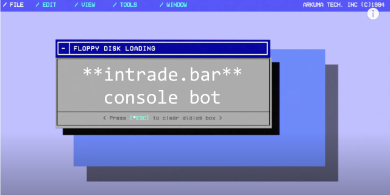

# intrade-bar-console-bot


*Консольный робот для торговли у брокера* https://intrade.bar/

## Особенности

* Бесплатный бот, без регистрации по рефералки и СМС.
* Полностью открытый исходный код.
* Написан на легком, понятном и удобном C++11.
* Наличие REST API.
* Библиотека для связи советника из МТ4 c программой.

## Как использовать

Готовые сборки программы находятся в архивах в папке *bin*, как для x64 так и для x32.

По умолчанию программа будет пытаться открыть файл с настройками config.json:

```json
{
	"email":"example@mail.com",
	"password":"12345",
	"demo_account":true,
	"rub_currency":false
}
```

Тем не менее, все настройки можно задать и без файла, через команды. Пример:

```
intrade-bar-console-bot.exe -email "example@mail.com" -password "12345" /demo /usd
```

Выберите один из способов задания настроек и укажите свой *email* и *password*. Файл *config.json* можно отредактировать любым блокнотом. Не забудьте, что файл *config.json* это структура json, т.е. сохраняйте синтаксис (*не удаляйте скобочки, запятые*).

После запуска программы она будет ждать соединения через named pipe. При этом программа выступает в роли сервера. По умолчанию сервер называется *intrade_bar_console_bot*.
Робот отсылает через named pipe баланс и состояние соединения с брокером, а принимает команды на открытие сделки.

## Библиотека для MT4

Для работы с советником проект имеет библиотеку, которая упрощает взаимодействие по REST API

```cpp
#include "..\Include\intrade_bar_console_bot_api.mqh"
IntradeBarConsoleBotApi api;        // API для работы с роботом

//Код, код, кот...

void OnTimer() {
	/* проверяем наличие соединения */
	if(api.connected()) {
		int expiration = 3;
		ENUM_BO_TYPE bo_type = SPRINT;// Тип опциона
		double amount = 50;
		api.open_deal("EURUSD", "BB-1", BUY, expiration, bo_type, amount);
	} else {
		/* соединение отсутствует, подключаемся */
		if(api.connect(pipe_name)) {
			Print("Успешное соединение с ", pipe_name);
		} else {
			Print("Соединение не удалось");
		}
	}
	/* обновляем состояние API */
	api.update(timer_period);
	if(api.check_balance_change()) {
		Print("Баланс: ",DoubleToString(api.get_balance(),2)); 
	}
	if(api.check_broker_connection_change()) {
		Print("Соединение с брокером: ",api.check_broker_connection()); 
	}
}
```

